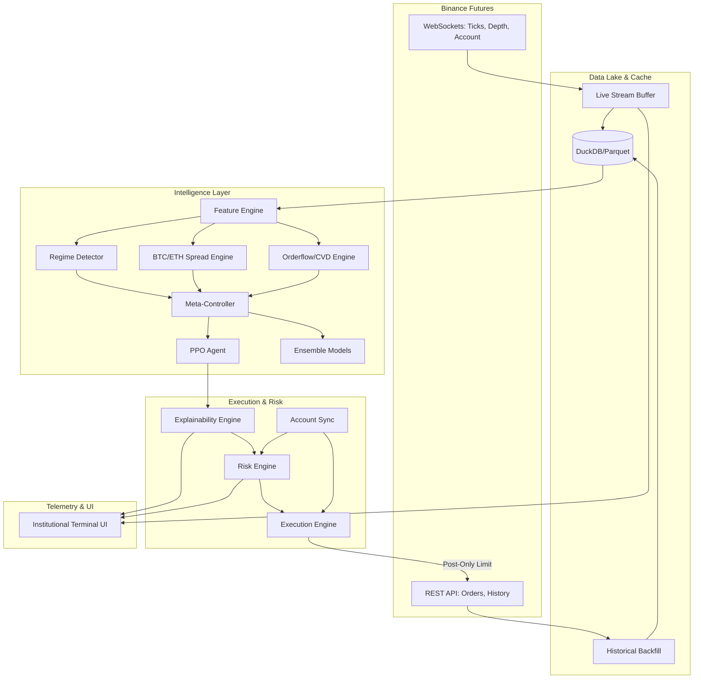
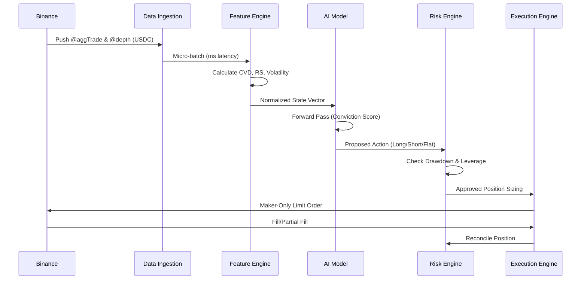
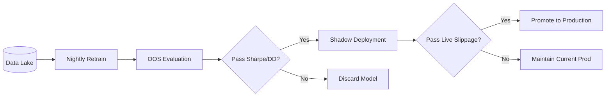

# APEX Institutional AI Trading System Blueprint

This document outlines the production-grade architecture for the autonomous ETHUSDC AI execution desk.

## 1. Complete Folder Structure

```text
apex_trading_engine/
├── configs/                  # Environment, risk, and model configuration yaml files
├── data_lake/                # Local data storage (DuckDB / Parquet)
│   ├── raw_ticks/            # Websocket raw trade ticks
│   ├── ohlcv/                # Aggregated klines
│   ├── features/             # Pre-computed multi-asset feature store
│   └── orderflow/            # Aggregated volume delta and liquidity sweeps
├── src/
│   ├── core/
│   │   ├── config_loader.py
│   │   ├── logger.py
│   │   └── security.py       # API key management, encryption
│   ├── data/                 
│   │   ├── binance_ws.py     # Live async websocket manager
│   │   ├── binance_rest.py   # Historical backfill and REST data
│   │   ├── cache_manager.py  # DuckDB/Parquet interface
│   │   └── feature_engine.py # Real-time & offline feature engineering
│   ├── execution/
│   │   ├── order_manager.py  # Maker-only limit order logic
│   │   ├── position_sync.py  # Account reconciliation (Websocket)
│   │   ├── risk_engine.py    # Kelly sizing, dynamic drawdown caps
│   │   └── slippage.py       # Execution optimization logic
│   ├── models/
│   │   ├── meta_controller.py # Ensembler/regime selector
│   │   ├── ppo_agent.py      # RL Actor-Critic models
│   │   ├── gbm_agent.py      # XGBoost/LightGBM fallback models
│   │   └── transformers/     # Sequence models for orderflow
│   ├── mlops/
│   │   ├── auto_retrain.py   # Nightly continuous learning pipeline
│   │   ├── evaluator.py      # Sharpe, DD, stability checks
│   │   ├── registry.py       # Model versioning (Shadow -> Prod)
│   │   └── explainability.py # Feature attribution and decision decoding
│   ├── pipelines/
│   │   ├── live_trade.py     # Main production loop
│   │   ├── shadow_trade.py   # Dry-run execution loop
│   │   └── backtest.py       # Historical simulation
├── frontend/                 # React/Zustand Dashboard UI
└── tests/                    # Unit & Integration tests
```

## 2. Full System Architecture


## 3. Data Flow Diagram


## 4. Training Pipeline & MLOps Architecture


## 5. Explainability Engine Design
The explainability engine intercepts the raw feature matrix and the neural network's activation gradients (or SHAP values for GBMs) at the exact moment of inference.

1. **Feature Attribution**: Calculates which features (e.g., `BTC_Lag`, `Vol_Expansion`) pushed the Actor network towards a Long or Short.
2. **Contextual Translation**: Maps statistical vectors into English (e.g., "Positive cumulative volume delta aligned with ETH relative strength").
3. **Regime Tagging**: Outputs the current detected regime (e.g., `LowVol_Compression`).
4. **Output Destination**: Serialized into a JSON payload and pushed via WebSocket to the React Dashboard and written to an immutable `trade_journal.json`.

## 6. Execution Engine Design (Maker-Only Optimization)
Because ETHUSDC has 0% Maker Fees, the execution engine operates strictly on a **Passive/Post-Only** basis.
1. **Spread Capture**: Places orders at `Bid + 1` or `Ask - 1` to secure queue priority.
2. **Post-Only Flag**: Every order uses `timeInForce=GTX` (Post Only). If the order would cross the book, Binance rejects it rather than charging a Taker fee.
3. **Chase Logic**: If the price moves away, the engine cancels and replaces (C&R) the limit order, evaluating slippage decay versus the model's alpha conviction.
4. **Account Sync**: Listens to the `ORDER_TRADE_UPDATE` user data stream to dynamically adjust resting orders if manual intervention occurs.

## 7. Database Schema & Smart Cache
**DuckDB** is used as the high-performance analytical cache, storing compressed Parquet files.
* **Partitioning**: `year=YYYY/month=MM/symbol=ETHUSDC/tf=1m`
* **Schema (OHLCV + Features)**:
  * `timestamp` (UTC)
  * `open`, `high`, `low`, `close`, `volume`
  * `cvd` (Cumulative Volume Delta)
  * `eth_btc_spread`, `regime_id`
* **Incremental Updates**: The system fetches the last timestamp from DuckDB on boot and only requests the missing delta via Binance REST API, transitioning to WS for the live edge.

## 8. Risk Engine Design
Risk is detached entirely from the AI Model. The AI proposes, the Risk Engine disposes.
* **Kelly Criterion Sizing**: Calculates optimal bet size based on historical win rate of the *currently active regime*.
* **Volatility Scaling**: Reduces position sizes during high-ATR periods.
* **Manual Override Sync**: If a discretionary manual trade is placed, the Risk Engine reduces the AI's available capital allocation dynamically to prevent margin exhaustion.
* **Kill Switch**: If equity drops by configurable `max_daily_drawdown`, all AI logic suspends, resting orders cancel, and the system flats the book.
