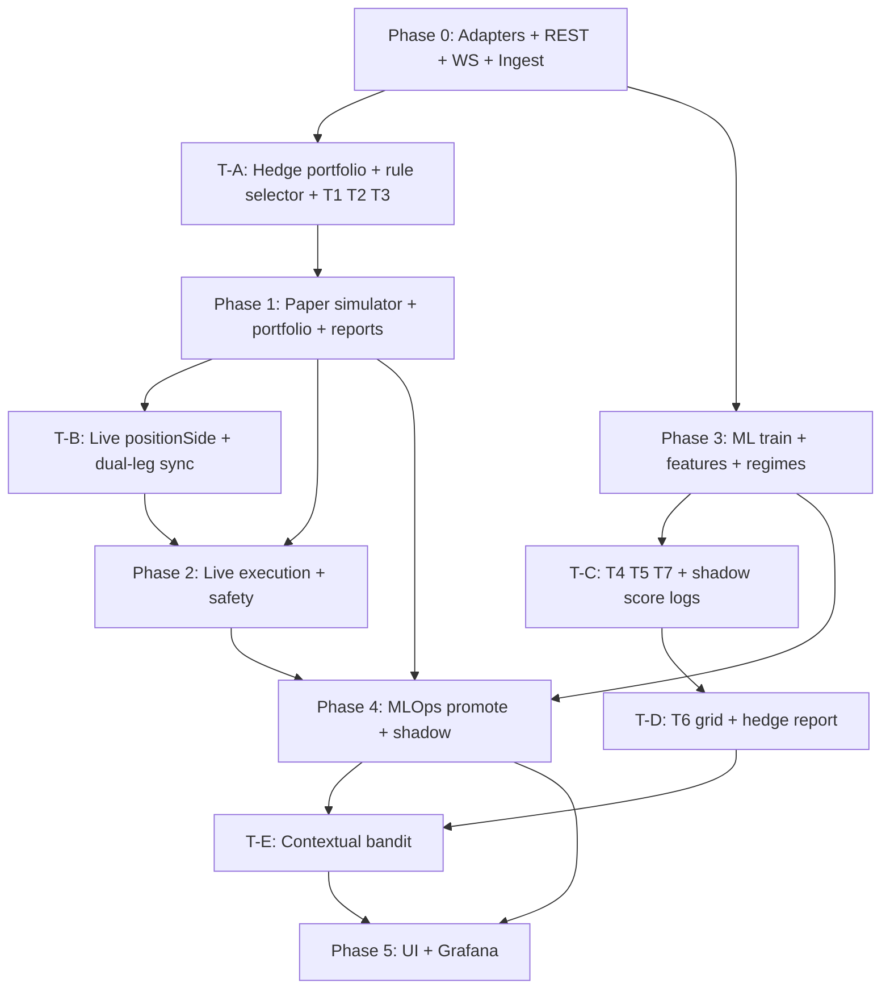

# APEX Production Checklist, Roadmap & Agent Prompt

This document turns the full institutional spec into an actionable checklist, defines **two operator modes** (paper / live) plus an **MLOps shadow sub-lane** (shared virtual simulator), **multi-strategy hedge mode** (rule-based selector → contextual bandit), lays out a phased roadmap to production, and includes a copy-paste **agent prompt** to complete the project.

> Implementation note (2026-05-19): milestone delivery through **Milestone 9** is now implemented in code and tracked in [PROGRESS.md](./PROGRESS.md). The historical checklist below is kept as the original production spec; use PROGRESS.md for current completion state and verification results.

---

## Trading modes (required architecture)

APEX has **two operator-selectable execution modes** (`paper` | `live`) and one **internal MLOps sub-lane** (shadow). Paper and shadow **share one virtual execution engine** but serve **different decisions** — do not merge their metrics or gates.

### Operator modes (only two)

| Mode | Config key | Capital | Orders | Market data | Purpose |
|------|------------|---------|--------|-------------|---------|
| **Paper** | `execution.mode: paper` | Virtual wallet (primary book) | Simulated maker fills vs live BBO/depth | Live Binance WS (mainnet read-only OK) | Validate the **deployed stack** (prod model + risk + execution + hedge) before live capital |
| **Live** | `execution.mode: live` | Real Binance USDC-M account | Real signed `GTX` post-only orders | Live WS + user stream | Production trading on the **primary** book only |

### Shadow sub-lane (MLOps — not a third operator mode)

| Aspect | Detail |
|--------|--------|
| **What it is** | Parallel **virtual book(s)** for **candidate models** from `ModelRegistry` — not something the operator picks instead of paper/live |
| **Config** | `shadow.enabled: true` (can run while `execution.mode` is `paper` **or** `live`) |
| **Simulator** | Same `PaperExecutionAdapter` as operator paper (one codebase, one fill model) |
| **Data** | Same feature bus as the active primary pipeline (shared ingest + regime + features) |
| **Orders** | **Never** places live exchange orders — even when primary is live |
| **Purpose** | Answer: “Is **model candidate B** better than **active prod A**?” for promote / discard / rollback |
| **Gate** | MLOps promotion service (`promotion_service.py`) — **not** the operator paper→live gate |

**Why keep both paper and shadow (separate purposes, shared engine):**

| | Operator **paper** (primary book) | **Shadow** sub-lane(s) |
|---|-----------------------------------|-------------------------|
| Question | Is the system safe to go live? | Is this new model better than prod? |
| Model | `active_prod` weights only | `active_shadow` / `EVALUATING` candidates |
| Typical duration | Fixed window (e.g. 7–14 days) | Continuous after each retrain |
| Metrics | System Sharpe, DD, fill rate, risk violations | Relative vs prod on same ticks |
| With `execution.mode: live` | Off (primary uses live adapter) | Still on — virtual only |

### Unified virtual execution architecture

```text
                    Live market data (WS + ingest)
                              │
              ┌───────────────┴───────────────┐
              ▼                               ▼
     Primary inference                 Shadow inference(s)
     (active_prod model)              (candidate model IDs)
              │                               │
              ▼                               ▼
     ┌────────────────────────────────────────────────────┐
     │         PaperExecutionAdapter (shared)              │
     │  book.role=primary          book.role=shadow        │
     │  virtual portfolio A        virtual portfolio B…  │
     └────────────────────────────────────────────────────┘
              │                               │
              ▼                               ▼
     paper gate / live unlock          promotion_service
```

When `execution.mode: live`, the **primary** path uses `LiveExecutionAdapter` (real orders); shadow paths **still** use `PaperExecutionAdapter` only.

```text
execution.mode: live
  Primary  → LiveExecutionAdapter  → Binance (real GTX)
  Shadow   → PaperExecutionAdapter → journal only (no exchange orders)
```

### Virtual books and journal tagging

Every journal row must disambiguate **operator mode**, **book role**, and **model**:

| Field | Values | Meaning |
|-------|--------|---------|
| `execution.mode` | `paper` \| `live` | Operator mode (was the primary stack in paper or live?) |
| `book.role` | `primary` \| `shadow` | Operator validation book vs MLOps candidate book |
| `book.id` | `primary` \| `shadow_{model_id}` | Portfolio instance key |
| `model_id` | registry id | Weights used for this inference |

Example primary (operator paper):

```json
{
  "execution": { "mode": "paper" },
  "book": { "role": "primary", "id": "primary" },
  "model_id": "ppo_ethusdc_vprod01"
}
```

Example shadow (while primary is live):

```json
{
  "execution": { "mode": "live" },
  "book": { "role": "shadow", "id": "shadow_ppo_ethusdc_vcandidate" },
  "model_id": "ppo_ethusdc_vcandidate"
}
```

### Configuration (target)

```yaml
execution:
  mode: paper              # paper | live  (operator only)
  position_mode: hedge     # one_way | hedge (orthogonal)

paper:
  enabled: true            # operator primary virtual book (implicit when mode=paper)
  min_days: 7
  min_trades: 100
  min_sharpe: 1.0
  max_drawdown: 0.08

live:
  enabled: false           # explicit live_enabled / operator confirm required

shadow:
  enabled: true            # MLOps parallel lane(s)
  auto_register: true      # pick up registry EVALUATING + active_shadow
  max_parallel_candidates: 2
  shared_features: true    # same feature bus as primary
```

### Paper mode requirements (primary book)

- Same signal path as live: features → regime → meta-controller → hedge orchestrator → explainability → risk.
- `PaperExecutionAdapter`: virtual post-only limits at BBO±tick; fill on trade/depth cross; partial fills; 0% maker fee on ETHUSDC.
- Virtual portfolio for `book.role=primary`: positions, equity, drawdown — persisted for dashboards and **paper→live gate**.
- Report: `python -m src.reports.paper_report` — Sharpe, max DD, win rate, fill rate (primary book only).

### Live mode requirements (primary book only)

- `LiveExecutionAdapter`: signed REST, `positionSide` when hedge mode, cancel/replace, account sync.
- Kill switch: cancel all + flatten primary; shadow books virtual-flat only.
- `live_enabled: true` + paper gate passed before start.

### Shadow sub-lane requirements

- `ShadowLaneRunner` (or equivalent): for each candidate, run inference → risk (shadow equity) → `PaperExecutionAdapter` with `book.role=shadow`.
- Log all 7 hedge candidate scores on shadow books if hedge enabled (for bandit dataset).
- `promotion_service`: compare shadow vs primary metrics over same window → `promote_to_prod` / discard / rollback.
- Deprecate standalone `shadow_trade.py` as a third pipeline; fold into `TradingPipeline` with shadow lanes enabled.

### CLI entrypoints (target)

```bash
# Operator paper (primary book; shadow lanes if shadow.enabled)
python -m src.pipelines.paper_trade --config configs/base.yaml

# Operator live (primary live + optional shadow virtual lanes)
python -m src.pipelines.live_trade --config configs/base.yaml
```

### Hedge mode (orthogonal to paper/live)

When `execution.position_mode: hedge`, the bot may hold separate LONG and SHORT legs on `ETHUSDC`. Seven hedge strategies run as plugins; a selector picks the best fit each tick (**rule-based first**, **contextual bandit** after enough history). Applies to **each virtual book and the live primary book** independently. See [Section T](#t-multi-strategy-hedge-mode-binance-hedge-mode--intelligent-selector).

---

## Requirement checklist

Legend: **Status** = `DONE` | `PARTIAL` | `MISSING`  
**Priority** = P0 (blocker) | P1 (production) | P2 (institutional polish)

---

### A. Core objective

| ID | Requirement | Status | Priority | What needs to be done |
|----|-------------|--------|----------|------------------------|
| A1 | Trade ETHUSDC perpetual futures on Binance USDC-M | PARTIAL | P0 | Implement signed futures REST (`place_order`, `cancel`, `position`, `leverage`); verify symbol `ETHUSDC`; set margin asset USDC in config and validation. |
| A2 | Signals from TA + microstructure only | PARTIAL | P0 | Expand `FeatureEngine` with real tick/orderflow inputs; document feature manifest; ban non-TA external data in config validation. |
| A3 | Continuous learning from new market data | MISSING | P1 | Wire WS/REST → incremental DuckDB append; nightly feature refresh job. |
| A4 | Automatic retrain + evaluate | PARTIAL | P1 | Replace mocks in `AutoRetrainPipeline` with real `PPOAgent.train()` / GBM fit; call `BacktestEngine` on OOS window. |
| A5 | Safe auto-promotion to production | MISSING | P1 | Implement promotion service: SHADOW metrics vs PROD + safety gates → `promote_to_prod`; automatic rollback on live DD breach. |
| A6 | Human-readable decision explanations | PARTIAL | P0 | Extend `ExplainabilityEngine`: confidence buckets (trend/momentum/liquidity/regime), why-flat, invalidation rules; same payload for paper and live. |
| A7 | Market regime detection + adaptation | PARTIAL | P1 | Add regimes (breakout, cascade, reversal); regime→strategy weights; expose in API/dashboard. |
| A8 | Manual trade synchronization | PARTIAL | P0 | In live + paper: on `AccountSynchronizer` callback, recompute exposure, call `risk_engine`, regenerate explanation for portfolio state. |
| A9 | Risk profiles (conservative/balanced/aggressive/custom) | MISSING | P0 | Add `configs/risk_profiles.yaml`; loader merges profile into `RiskEngine`; CLI override. |
| A10 | Full observability (reasoning, signals, confidence, execution) | MISSING | P1 | Prometheus metrics + structured log schema; HTTP/WS API for terminal; paper/live labeled metrics. |

---

### B. USDC mandate (no USDT)

| ID | Requirement | Status | Priority | What needs to be done |
|----|-------------|--------|----------|------------------------|
| B1 | No USDT symbols or assumptions | DONE | P0 | Add CI grep test forbidding `USDT` in `src/`, `configs/`, `tests/`. |
| B2 | All modules use USDC-M contracts | PARTIAL | P0 | Audit scripts, notebooks, examples; default `BTCUSDC` macro; validate config schema. |
| B3 | USDC collateral / position accounting | MISSING | P0 | Parse USDC wallet from account stream; size orders in USDC notional; respect isolated/cross config. |
| B4 | Maker-fee optimization (0% maker ETHUSDC) | PARTIAL | P0 | Enforce `GTX` in both adapters; paper sim assumes 0 maker fee; document taker rejection handling. |

---

### C. Explainability engine

| ID | Requirement | Status | Priority | What needs to be done |
|----|-------------|--------|----------|------------------------|
| C1 | Dedicated explainability layer | DONE | P0 | Keep `ExplainabilityEngine`; add unit tests for paper+live paths. |
| C2 | Structured reasoning per decision | PARTIAL | P0 | JSON schema v1: decision, reasons, risk_factors, regime, model, feature_weights. |
| C3 | Confidence decomposition (trend/momentum/liquidity/regime) | MISSING | P0 | Map features to buckets; aggregate weighted scores; include in payload. |
| C4 | Regime + liquidity + market structure narrative | PARTIAL | P1 | Add template strings from feature values (funding, spread, sweep flags). |
| C5 | Why position open / why flat / invalidation | MISSING | P0 | Position state machine emits lifecycle events to explainability. |
| C6 | Outputs: logs, journal, API, dashboard, telemetry | PARTIAL | P1 | JSONL journal (done); add FastAPI `/explain/latest` and WS stream; Grafana panels. |
| C7 | SHAP / gradient attribution for models | MISSING | P2 | Integrate SHAP for GBM; optional Grad-CAM or input×gradient for PPO. |

---

### D. Manual trade synchronization

| ID | Requirement | Status | Priority | What needs to be done |
|----|-------------|--------|----------|------------------------|
| D1 | Real-time account reconciliation | PARTIAL | P0 | `AccountSynchronizer` done for live; paper mode skips or uses testnet account optional. |
| D2 | Detect manual open/scale/hedge/close | PARTIAL | P0 | Compare position snapshots; emit `ManualInterventionEvent`. |
| D3 | Recalculate portfolio + risk + strategies | MISSING | P0 | `PortfolioService` shared by paper/live; update on every account event. |
| D4 | Explain updated state after manual change | MISSING | P1 | Trigger `decode_portfolio_state()` not only per-trade signal. |

---

### E. Risk configuration system

| ID | Requirement | Status | Priority | What needs to be done |
|----|-------------|--------|----------|------------------------|
| E1 | Configurable max leverage, daily DD, exposure, position size | PARTIAL | P0 | Add all fields to `configs/base.yaml` + schema; implement in `RiskEngine`. |
| E2 | Risk per trade, vol-adjusted sizing, Kelly cap | PARTIAL | P0 | Vol scaling from ATR; wire Kelly to regime win-rate table. |
| E3 | AI confidence thresholds, regime/session restrictions | MISSING | P1 | Reject trades below threshold; no-trade windows (e.g. funding). |
| E4 | Cooldown periods | MISSING | P1 | Per-symbol cooldown after loss streak or flat. |
| E5 | Profiles: conservative / balanced / aggressive / custom | MISSING | P0 | YAML profiles + `risk.profile` config key. |
| E6 | Dynamic allocation from confidence, regime, edge, vol | MISSING | P1 | `PositionSizer` module called by risk engine. |
| E7 | Kill switch + emergency flat | PARTIAL | P0 | On trigger: cancel all orders, market close or aggressive GTX limits; paper sim same. |
| E8 | Paper mode uses same risk rules as live | MISSING | P0 | Single `RiskEngine` instance; virtual equity from paper portfolio. |

---

### F. Paper vs live execution (NEW — user priority)

| ID | Requirement | Status | Priority | What needs to be done |
|----|-------------|--------|----------|------------------------|
| F1 | `execution.mode`: `paper` \| `live` | MISSING | P0 | Config + env override `APEX_EXECUTION_MODE`; validate at startup. |
| F2 | Shared trading loop, pluggable execution adapter | MISSING | P0 | Refactor `LiveTradePipeline` → `TradingPipeline` with `ExecutionAdapter` interface. |
| F3 | `PaperExecutionAdapter` | MISSING | P0 | Virtual order book; post-only logic; fill simulation from aggTrade/depth; partial fills. |
| F4 | `LiveExecutionAdapter` | MISSING | P0 | Wrap `OrderManager` + signed REST; real cancel/replace. |
| F5 | Virtual portfolio + persistence | MISSING | P0 | Table `paper_portfolio_snapshots`; equity curve for reports. |
| F6 | Paper performance dashboard / report | MISSING | P1 | Daily summary JSON + optional Grafana; compare to backtest. |
| F7 | Gate: live only after paper criteria met | MISSING | P1 | Config `paper.min_days`, `paper.min_trades`, `paper.min_sharpe`; refuse live start if fail. |
| F8 | Binance testnet option (optional) | MISSING | P2 | `paper.use_testnet: true` with testnet URLs for closer fill realism. |
| F9 | Journal tags: `execution.mode`, `book.role`, `model_id` | MISSING | P0 | Schema per Trading modes section; primary vs shadow never mixed in metrics. |
| F10 | Single `PaperExecutionAdapter` for primary + shadow | MISSING | P0 | Multi-book portfolios keyed by `book.id`; no duplicate simulators. |
| F11 | `ShadowLaneRunner` inside `TradingPipeline` | MISSING | P1 | Replace standalone `shadow_trade.py`; shadow when `shadow.enabled` on paper **or** live. |
| F12 | Separate gates: paper→live vs shadow→promote | MISSING | P1 | `paper_report` (primary only) vs `promotion_service` (shadow vs prod). |

---

### G. MLOps & model evolution

| ID | Requirement | Status | Priority | What needs to be done |
|----|-------------|--------|----------|------------------------|
| G1 | Pipeline: train → validate → backtest → stress → paper → shadow → rank → promote | PARTIAL | P1 | Implement orchestrator script; replace CI `echo` stubs. |
| G2 | Model registry + versioning + metadata | PARTIAL | P1 | Add artifact paths, git hash, data snapshot id, hyperparams. |
| G3 | Reproducibility (seeds, data version) | MISSING | P1 | Manifest per training run in `data_lake/models/{id}/manifest.json`. |
| G4 | Shadow sub-lane parallel to primary (not a third mode) | PARTIAL | P1 | `ShadowLaneRunner` + shared `PaperExecutionAdapter`; runs under paper or live operator mode. |
| G5 | Auto-promotion safety gates | PARTIAL | P1 | Compare shadow book vs primary prod metrics; independent of operator paper→live gate. |
| G6 | Automatic rollback | MISSING | P1 | On live underperformance vs prod baseline → revert registry `active_prod`. |
| G7 | Experiment tracking | MISSING | P2 | MLflow or simple SQLite experiment DB. |

---

### H. Market regime engine

| ID | Requirement | Status | Priority | What needs to be done |
|----|-------------|--------|----------|------------------------|
| H1 | Regimes: trend, mean reversion, compression, vol expansion, chop | PARTIAL | P1 | Current 5 regimes; tune thresholds on real data. |
| H2 | Regimes: breakout, liquidation cascade, momentum, reversal | MISSING | P1 | Add detectors using OI, funding, vol spikes. |
| H3 | Strategy adaptation by regime | PARTIAL | P1 | Meta-controller mapping; dynamic edge weights per regime. |
| H4 | "Which indicators work best now" | MISSING | P2 | Rolling hit-rate per indicator per regime in DuckDB. |

---

### I. Dynamic edge engine

| ID | Requirement | Status | Priority | What needs to be done |
|----|-------------|--------|----------|------------------------|
| I1 | Adaptive signal weighting | MISSING | P2 | Online update weights from recent paper/live trade outcomes. |
| I2 | Indicator effectiveness tracking | MISSING | P2 | Store per-indicator PnL attribution weekly. |

---

### J. BTC ↔ ETH relative strength

| ID | Requirement | Status | Priority | What needs to be done |
|----|-------------|--------|----------|------------------------|
| J1 | ETH/BTC spread, rolling beta, z-score | DONE | P1 | Already in `FeatureEngine`. |
| J2 | Lag detection, divergence, lead/lag | MISSING | P2 | Cross-correlation at multiple lags; divergence signals. |
| J3 | Correlation instability | MISSING | P2 | Rolling corr variance alert feature. |

---

### K. Orderflow & microstructure

| ID | Requirement | Status | Priority | What needs to be done |
|----|-------------|--------|----------|------------------------|
| K1 | CVD | PARTIAL | P0 | Use real `taker_buy_volume` from klines/trades; persist to orderflow store. |
| K2 | Aggressive buyer/seller, sweeps | PARTIAL | P1 | Extend from ticks; improve sweep logic. |
| K3 | Imbalance zones, FVG, volume profile, VWAP deviation | MISSING | P2 | New feature modules + tests. |
| K4 | Liquidation clusters, OI, funding in features | MISSING | P1 | REST/WS feeds; store in DuckDB; join to feature matrix. |

---

### L. Data architecture

| ID | Requirement | Status | Priority | What needs to be done |
|----|-------------|--------|----------|------------------------|
| L1 | Raw tick store | PARTIAL | P0 | `insert_ticks()`, batch writer from WS, partitioned Parquet. |
| L2 | OHLCV store | DONE | P0 | Keep; add gap-repair orchestrator. |
| L3 | Feature store | MISSING | P1 | DuckDB `features` table; versioned by `feature_set_id`. |
| L4 | Orderflow store | MISSING | P1 | Persist CVD, sweeps, deltas per bar. |
| L5 | Model artifact store | PARTIAL | P1 | Save/load torch + lightgbm in registry paths. |
| L6 | Replay dataset store | MISSING | P2 | Export session slices for `make replay-debug`. |
| L7 | Incremental fetch (missing ranges only) | MISSING | P0 | `DataIngestionService`: `get_latest_timestamp` → REST backfill → WS tail. |
| L8 | Gap detection + repair | MISSING | P0 | Scan OHLCV for holes; auto backfill. |
| L9 | Parquet partition by symbol/tf/date | PARTIAL | P1 | Extend backup paths `year=/month=`. |
| L10 | Redis cache (hot features) | MISSING | P2 | Optional; docker-compose for prod profile. |
| L11 | TimescaleDB (optional long retention) | MISSING | P2 | Optional sync from DuckDB for ops team. |
| L12 | Fix futures WS URL | MISSING | P0 | Use `wss://fstream.binance.com/stream` not spot `stream.binance.com`. |

---

### M. Live data ingestion

| ID | Requirement | Status | Priority | What needs to be done |
|----|-------------|--------|----------|------------------------|
| M1 | WS: trades, depth, funding, OI, mark, liquidations | PARTIAL | P0 | Implement `_handle_message`; subscribe streams; persist. |
| M2 | Incremental live append (no full re-download) | MISSING | P0 | Background ingest task in paper/live pipelines. |
| M3 | Near-real-time feature generation | MISSING | P0 | Micro-batch every N sec or on bar close; push to inference queue. |

---

### N. Model architecture

| ID | Requirement | Status | Priority | What needs to be done |
|----|-------------|--------|----------|------------------------|
| N1 | PPO agent train + save + load | MISSING | P1 | Training loop, checkpointing, load in meta-controller from registry path. |
| N2 | GBM (LightGBM/XGBoost) real model | MISSING | P1 | Replace `MockLGBMClassifier`; train on feature matrix. |
| N3 | Transformer sequence model | MISSING | P2 | `src/models/transformers/` for orderflow sequences. |
| N4 | Meta-controller regime routing | DONE | P1 | Load prod weights per regime when specialists exist. |
| N5 | Ensemble / multiple coexisting models | PARTIAL | P2 | Vote or stack beyond single model per regime. |

---

### O. Execution engine (maker-only)

| ID | Requirement | Status | Priority | What needs to be done |
|----|-------------|--------|----------|------------------------|
| O1 | Post-only GTX live orders | PARTIAL | P0 | Implement `BinanceRESTClient.place_order` + cancel with signature. |
| O2 | Intelligent placement (BBO ± tick) | PARTIAL | P0 | Live adapter; paper uses same pricing rules. |
| O3 | Partial fills, scaling | MISSING | P1 | Track fill qty in both adapters. |
| O4 | Iceberg / queue-aware (optional) | MISSING | P2 | Queue position estimate from depth. |
| O5 | Chase / cancel-replace | PARTIAL | P0 | Real `cancel_order` API; paper cancel virtual orders. |
| O6 | Slippage minimization + alpha decay | PARTIAL | P1 | `SlippageManager` wired in both modes. |

---

### P. Observability & telemetry

| ID | Requirement | Status | Priority | What needs to be done |
|----|-------------|--------|----------|------------------------|
| P1 | Prometheus metrics | MISSING | P1 | `apex_*` metrics: latency, ws_connected, paper_pnl, live_pnl. |
| P2 | Grafana dashboards | MISSING | P1 | docker-compose stack; paper vs live panels. |
| P3 | Structured logs | PARTIAL | P1 | JSON log formatter; correlation id per decision. |
| P4 | Trade replay | PARTIAL | P2 | Session export from paper journal. |
| P5 | Model/feature drift detection | MISSING | P2 | PSI on feature distributions vs training set. |

---

### Q. Terminal UI

| ID | Requirement | Status | Priority | What needs to be done |
|----|-------------|--------|----------|------------------------|
| Q1 | React institutional terminal | MISSING | P2 | Regime, BTC/ETH, orderflow, reasoning, risk, model id, paper PnL. |
| Q2 | Mode indicator (PAPER / LIVE) | MISSING | P1 | Prominent banner; live requires confirm. |
| Q3 | API backend for UI | MISSING | P1 | FastAPI: `/status`, `/explain`, `/positions`, `/metrics`. |

---

### R. Security & operations

| ID | Requirement | Status | Priority | What needs to be done |
|----|-------------|--------|----------|------------------------|
| R1 | Encrypted API keys | DONE | P0 | Keep `SecurityManager`; wire into REST client init. |
| R2 | Disaster recovery plan | MISSING | P2 | Doc + backup registry + data lake sync. |
| R3 | Infrastructure scaling plan | MISSING | P2 | Doc: single host → k8s optional. |

---

### S. Testing & CI

| ID | Requirement | Status | Priority | What needs to be done |
|----|-------------|--------|----------|------------------------|
| S1 | Unit tests (risk, explainability, data) | DONE | P0 | Maintain; add paper adapter tests. |
| S2 | Integration: paper loop end-to-end | MISSING | P0 | Mock WS → features → paper fill → journal. |
| S3 | CI paper-trading workflow | MISSING | P1 | Run `paper_trade` N hours on schedule with artifacts. |
| S4 | Live smoke test (manual gated) | MISSING | P2 | Testnet only in CI secrets. |

---

### T. Multi-strategy hedge mode (Binance hedge mode + intelligent selector)

Binance **hedge mode** allows simultaneous **LONG** and **SHORT** positions on `ETHUSDC`. APEX runs seven hedge strategies as **plugins**; a **Hedge Strategy Selector** picks at most **one primary** strategy per decision (or **NONE**). Selection evolves: **rule-based scorer first**, then **contextual bandit** after sufficient paper/live history.

#### T.0 Architecture overview

```text
Features + Regime + Directional AI (PPO/GBM MetaController)
       ↓
Primary leg intent (LONG / SHORT / FLAT size via Kelly)
       ↓
HedgeStrategySelector  [rule_based → contextual_bandit]
       ↓  scores all 7 plugins; picks argmax if score ≥ min_score
HedgeOrchestrator      [single writer for leg targets]
       ↓
RiskEngine             [max_net_leverage, max_gross_leverage, max_hedge_ratio]
       ↓
ExecutionAdapter       [positionSide=LONG|SHORT, GTX post-only]
```

**Layer responsibilities:**

| Component | Role |
|-----------|------|
| `HedgeContext` | Snapshot: regime, features, model probs, risk_factors, funding, current long/short qty, mode |
| `HedgeStrategy` (×7) | `score(ctx) → float` and `propose(ctx) → HedgeProposal` |
| `RuleBasedHedgeSelector` | Default; transparent scoring from market rules |
| `ContextualBanditSelector` | Phase T4; learns from journal rewards per (regime, strategy) |
| `HedgeOrchestrator` | Merges directional + winning hedge proposal; never lets plugins write orders directly |
| `PortfolioService` | Tracks `long_qty`, `short_qty`, `net_delta`, `gross_notional` per symbol |

**Selection policy (v1 — rule-based):**

1. Each enabled strategy computes `score ∈ [0, 1]`.
2. If `max(scores) < hedge.min_score` (default `0.5`) → **NONE** (directional only, no hedge leg).
3. Else select `argmax(scores)` as **primary hedge strategy** for this tick.
4. **No multi-strategy blend in v1** (avoid gross exposure stacking). v2 may allow guarded blends (e.g. protective + disagreement) behind feature flag.
5. **Hard overrides:** kill switch → all strategies return reduce-only / flat both legs; gross cap hit → skip opening new hedge legs.

**Selection policy (v2 — contextual bandit, after history threshold):**

- Switch when `hedge.selection: contextual_bandit` AND `hedge.bandit.min_decisions ≥ N` (e.g. 500 per strategy in journal).
- Bandit context: regime id, vol z-score bucket, funding bucket, model disagreement flag.
- Reward: risk-adjusted PnL of hedge leg over next H bars (configurable), logged from paper first.
- **Always log rule-based scores alongside bandit choice** for explainability and rollback to rules.

#### T.1 The seven hedge strategy plugins

| ID | Plugin name | Module (target) | High score when | Proposal shape |
|----|-------------|-----------------|-----------------|----------------|
| T1 | `signal_disagreement` | `signal_disagreement.py` | PPO vs GBM conflict; chop / mean-reversion regime | Opposite leg at `max_hedge_ratio × primary` |
| T2 | `regime_straddle` | `regime_straddle.py` | `CHOP_COMPRESSION` + low vol z-score | Small LONG + small SHORT; on breakout scale winner |
| T3 | `protective_hedge` | `protective_hedge.py` | Primary leg open + ≥ N explainability risk_factors | Add opposite leg 15–30% size |
| T4 | `eth_btc_rs_hedge` | `eth_btc_rs_hedge.py` | \|eth_btc_zscore\| high + microstructure vs direction conflict | Bias primary from RS; hedge opposite |
| T5 | `sweep_dual_leg` | `sweep_dual_leg.py` | Recent liquidity sweep + conflicting follow-through CVD | Controlled dual leg until structure aligns |
| T6 | `maker_grid_hedge` | `maker_grid_hedge.py` | Chop + tight spread + low trend_slope | Post-only grid both sides; inventory hedge |
| T7 | `funding_bias_hedge` | `funding_bias_hedge.py` | \|funding_rate\| extreme + mild trend agreement | Bias leg with funding; tactical opposite hedge |

**Rule-based scoring reference (implement in each plugin’s `score()`):**

| Plugin | Score boosts (+) | Score penalties (−) |
|--------|------------------|---------------------|
| T1 | `abs(ppo_action - gbm_action) >= 2`, high min conviction on both | Models agree; strong trend regime |
| T2 | `regime == CHOP_COMPRESSION`, `volatility_zscore < -1` | `STRONG_TREND_*`, `VOLATILITY_EXPANSION` |
| T3 | `len(risk_factors) >= 2`, primary leg non-zero | Flat book; kill switch |
| T4 | `\|eth_btc_zscore\| > 1.5`, TA conflicts with RS direction | z-score near 0 |
| T5 | sweep flag + CVD sign conflict | No sweep in last N bars |
| T6 | chop + `abs(trend_slope) < threshold` | Wide spread / trend breakout |
| T7 | `\|funding_rate\| > funding_extreme_threshold` | Funding near zero (feature required) |

#### T.2 Requirement checklist (Section T)

| ID | Requirement | Status | Priority | What needs to be done |
|----|-------------|--------|----------|------------------------|
| T0 | Binance account hedge mode + API | MISSING | P0 | `dualSidePosition: true`; every order includes `positionSide`; validate on startup. |
| T1 | Two-leg portfolio model | MISSING | P0 | `PortfolioService`: long_qty, short_qty, net, gross; paper + live. |
| T2 | `HedgeStrategy` protocol + registry | MISSING | P0 | `src/strategies/hedge/base.py`; config enable/disable per plugin. |
| T3 | All 7 strategy plugins implemented | MISSING | P1 | One module per strategy; unit tests with fixture `HedgeContext`. |
| T4 | `RuleBasedHedgeSelector` | MISSING | P0 | `score_all()` → dict; `select()` → name + scores; `min_score` gate. |
| T5 | `HedgeOrchestrator` | MISSING | P0 | Merge directional + hedge proposal; single leg delta output. |
| T6 | Risk: gross/net/hedge ratio caps | MISSING | P0 | Extend `RiskEngine` for hedge mode limits. |
| T7 | Explainability: hedge block in journal | MISSING | P0 | `hedge.selected`, `hedge.candidates`, `hedge.proposal`, selection mode. |
| T8 | Paper sim: two-leg maker fills | MISSING | P0 | `PaperExecutionAdapter` tracks LONG/SHORT orders separately. |
| T9 | Live: GTX orders with positionSide | MISSING | P0 | `LiveExecutionAdapter` / `place_order` signature. |
| T10 | `AccountSynchronizer` dual-leg parse | MISSING | P0 | Position updates keyed by `(symbol, positionSide)`. |
| T11 | Shadow scoring in paper (all 7 logged) | MISSING | P1 | Log non-selected strategy scores for bandit training data. |
| T12 | `ContextualBanditSelector` | MISSING | P2 | LinUCB or Thompson sampling; load/save state in `data_lake/hedge_bandit/` |
| T13 | Bandit activation gate | MISSING | P2 | `hedge.bandit.min_decisions`; fallback to rules if insufficient data. |
| T14 | Per-strategy paper performance report | MISSING | P1 | `apex report hedge --days 7` — PnL attribution by strategy. |
| T15 | Integration test: selector picks expected strategy | MISSING | P0 | Fixture contexts → assert argmax strategy. |
| T16 | `#6 maker_grid` execution sub-adapter | MISSING | P1 | Route to grid placement when T6 selected; still under risk caps. |

#### T.3 Configuration (target)

```yaml
execution:
  position_mode: hedge          # one_way | hedge
  mode: paper                   # paper | live

hedge:
  enabled: true
  selection: rule_based         # rule_based | contextual_bandit
  min_score: 0.5
  max_hedge_ratio: 0.35         # hedge leg vs primary leg notional
  max_gross_leverage: 2.0       # (long + short) notional / equity
  max_net_leverage: 1.0         # |long - short| / equity

  strategies:
    signal_disagreement: { enabled: true }
    regime_straddle:     { enabled: true, straddle_size_fraction: 0.25 }
    protective_hedge:    { enabled: true, min_risk_factors: 2, hedge_fraction: 0.25 }
    eth_btc_rs_hedge:    { enabled: true, zscore_entry: 1.5 }
    sweep_dual_leg:      { enabled: true, sweep_lookback_bars: 3 }
    maker_grid_hedge:    { enabled: true, grid_levels: 3, grid_spacing_ticks: 2 }
    funding_bias_hedge:  { enabled: true, funding_extreme: 0.0003 }

  bandit:
    min_decisions: 500          # per strategy before bandit eligible
    reward_horizon_bars: 5
    exploration_factor: 0.1
    state_path: data_lake/hedge_bandit/state.json
```

#### T.4 Explainability payload (hedge extension)

Every decision journal entry must include:

```json
{
  "hedge": {
    "selection_mode": "rule_based",
    "selected": "protective_hedge",
    "selected_score": 0.78,
    "candidates": {
      "signal_disagreement": 0.52,
      "regime_straddle": 0.41,
      "protective_hedge": 0.78,
      "eth_btc_rs_hedge": 0.33,
      "sweep_dual_leg": 0.20,
      "maker_grid_hedge": 0.38,
      "funding_bias_hedge": 0.12
    },
    "proposal": {
      "long_delta_qty": 0.0,
      "short_delta_qty": 0.15,
      "intent": "insurance_against_risk_factors"
    }
  }
}
```

When bandit is active, add `"bandit_arm": "protective_hedge"`, `"exploration": false`, and retain rule-based scores as `"candidates_rule_shadow"`.

#### T.5 Phased delivery within product roadmap

| Sub-phase | When | Deliverables |
|-----------|------|--------------|
| **T-A** | With Phase 0–1 | Hedge portfolio model; `positionSide` paper sim; `RuleBasedHedgeSelector` + plugins **T1, T3, T2** |
| **T-B** | With Phase 2 | Live hedge orders; dual-leg account sync; risk gross/net caps |
| **T-C** | With Phase 3 | Plugins **T4, T5, T7** (funding feature); shadow score logging for all 7 |
| **T-D** | With Phase 3–4 | Plugin **T6** grid sub-adapter; hedge attribution report |
| **T-E** | After 500+ paper decisions/strategy | `ContextualBanditSelector`; config switch; A/B vs rules in paper |

**Exit criteria (hedge mode production-ready):**

- [ ] Paper runs 14+ days with hedge enabled; all 7 strategies log scores each tick.
- [ ] Operator can read journal and see why a hedge strategy was selected.
- [ ] Gross leverage never exceeds config; kill switch flats both legs.
- [ ] Bandit activates only after `min_decisions`; rollback to `rule_based` via config without deploy.

---

## Phased roadmap to production

Estimated effort assumes one strong full-time engineer (+ AI assistance). Adjust for team size.

### Phase 0 — Foundations (Week 1–2) — P0

**Goal:** Paper and live modes exist structurally; data and orders unblocked.

| Deliverable | Tasks |
|-------------|-------|
| Execution mode framework | `ExecutionAdapter` ABC; `PaperExecutionAdapter`, `LiveExecutionAdapter`; `execution.mode` in config |
| Signed Binance REST | `place_order`, `cancel_order`, `get_positions`, HMAC signing; use `SecurityManager` |
| Futures WS fix | Correct `fstream` URLs; implement `BinanceWebSocket._handle_message` → tick/OHLCV writer |
| Data ingestion v1 | `DataIngestionService`: incremental backfill + WS append; `insert_ticks()` |
| Unified trading pipeline | Refactor `live_trade.py` → `trading_pipeline.py` used by `paper_trade.py` and `live_trade.py` |
| Risk profile YAML | conservative / balanced / aggressive |
| Kill switch actions | Cancel + flat (live); flatten virtual (paper) |
| Hedge **T-A** (foundation) | `PortfolioService` two-leg model; `position_mode: hedge` config; `HedgeStrategy` protocol + `RuleBasedHedgeSelector` skeleton |

**Exit criteria:** Paper mode runs 24h on live market data with virtual fills, journal entries, and equity curve — no real orders.

---

### Phase 1 — Paper trading production-quality (Week 3–4) — P0

**Goal:** Trust paper results before live.

| Deliverable | Tasks |
|-------------|-------|
| Paper fill simulator | Maker logic, partial fills, queue distance, 0% fee |
| Virtual portfolio service | Positions, USDC equity, DD tracking; persist snapshots |
| Manual sync (paper) | Optional: read-only account or fully isolated virtual book |
| Explainability v2 | Confidence buckets; mode tag; why-flat |
| Paper performance report | CLI `apex report paper --days 7` |
| Live promotion gate | Config blocks live if paper criteria not met |
| Integration tests | Full paper loop test in CI |
| Hedge **T-A** (plugins) | Implement **T1** signal_disagreement, **T3** protective_hedge, **T2** regime_straddle; `HedgeOrchestrator`; hedge block in explainability |

**Exit criteria:** 7-day paper run report with Sharpe, DD, fill rate; operator review sign-off. Hedge journal shows strategy scores every tick.

---

### Phase 2 — Live execution minimal (Week 5–6) — P0

**Goal:** Small capital live with same brain as paper.

| Deliverable | Tasks |
|-------------|-------|
| Live adapter wired | Real GTX orders; cancel/replace |
| Account sync → risk | Position changes update exposure and explanations |
| Live safety | `live_enabled` flag; kill switch tested on testnet |
| Observability v1 | Prometheus + structured logs; paper/live metric labels |
| Hedge **T-B** | Live `positionSide` GTX orders; dual-leg `AccountSynchronizer`; gross/net risk caps |

**Exit criteria:** 48h testnet live (or minimal mainnet size) with zero risk violations; journal matches Binance fills. Hedge legs reconcile on Binance.

---

### Phase 3 — Intelligence & data depth (Week 7–10) — P1

| Deliverable | Tasks |
|-------------|-------|
| Feature store + orderflow persistence | Funding, OI, improved CVD |
| Regime expansion | Additional regimes; funding session rules |
| Real GBM + PPO train/load | Replace mocks; registry artifacts |
| Backtest ↔ paper parity | Same fill model in backtest as paper |
| MLOps v1 | Real `AutoRetrainPipeline`; shadow on paper adapter |
| Hedge **T-C** | Plugins **T4**, **T5**, **T7**; log all 7 strategy scores (shadow) for bandit dataset |
| Hedge **T-D** | Plugin **T6** maker grid sub-adapter; `apex report hedge` attribution |

**Exit criteria:** Nightly retrain produces candidate; shadow paper beats prod baseline for 5 days → eligible for promotion. Hedge score logs retained in `data_lake/hedge_bandit/training/`.

---

### Phase 4 — MLOps promotion & shadow sub-lane (Week 11–12) — P1

| Deliverable | Tasks |
|-------------|-------|
| Auto-promotion service | Gates + `promote_to_prod` + rollback (shadow vs primary prod) |
| Shadow sub-lane | `ShadowLaneRunner` + multi-book `PaperExecutionAdapter`; works under paper or live operator mode |
| CI workflows | Real paper-trading (primary book) and model-eval / shadow artifact upload |

**Exit criteria:** One full cycle: train → shadow → promote → rollback drill successful.

---

### Phase 5 — Terminal & institutional polish (Week 13–16) — P2

| Deliverable | Tasks |
|-------------|-------|
| FastAPI + React terminal | Mode banner, explainability, paper PnL vs live |
| Grafana dashboards | |
| Dynamic edge / advanced microstructure | As needed |
| DR + scaling docs | |
| Hedge **T-E** | `ContextualBanditSelector`; config `hedge.selection: contextual_bandit` after `min_decisions`; terminal panel for hedge candidates |

**Exit criteria:** Operator can monitor and explain every trade without reading raw logs. Bandit can be disabled instantly via config fallback to rule-based.

---

## Dependency graph (simplified)



---

## AI agent master prompt

Copy everything below the line into a new Agent session (Agent mode, full repo access).

---

### BEGIN AGENT PROMPT

You are completing **APEX** (`apex_trading_engine`), an institutional-grade autonomous AI trading system for **Binance USDC-M ETHUSDC perpetual futures**. The repository has a solid skeleton (~22 Python modules, tests, `architecture_blueprint.md`) but is **not production-ready**. Your job is to implement the full system per the checklist in `docs/PRODUCTION_CHECKLIST_AND_ROADMAP.md` and this prompt.

#### Non-negotiable constraints

1. **USDC only** — `ETHUSDC` target, `BTCUSDC` macro. Never introduce USDT symbols. Add a CI test that fails on `USDT` in `src/`, `configs/`, `tests/`.
2. **Maker-only execution** — All live orders use limit + `timeInForce=GTX` (post-only). Paper sim must model the same.
3. **Two operator modes only** — `execution.mode: paper | live` (no third operator mode):
   - **Paper:** Primary virtual book (`book.role=primary`); live market data; simulated maker fills — **no real orders**.
   - **Live:** Primary real GTX orders after paper gate; shadow (if enabled) stays virtual only.
   - **Shadow sub-lane:** `shadow.enabled` — MLOps candidate book(s) (`book.role=shadow`) using the **same** `PaperExecutionAdapter` as operator paper; never places exchange orders; see Trading modes section.
4. **Explainability is first-class** — Every decision produces structured JSON. Journal must include `execution.mode`, `book.role`, `book.id`, `model_id`, plus hedge block when applicable. Write to `data_lake/trade_journal.jsonl`.
5. **Risk is separate from AI** — AI proposes; `RiskEngine` disposes. Same rules in paper and live. Kill switch must cancel orders and flatten (live) or virtual flatten (paper).
6. **Do not break existing tests** — Run `make test-risk` and `make test` after each major milestone. Fix regressions.
7. **Minimal scope creep** — No unrelated refactors. Match existing code style (async aiohttp, DuckDB, yaml config).
8. **No secrets in repo** — Use `SecurityManager` + env vars only.
9. **Hedge mode (multi-strategy)** — Binance hedge mode with **seven pluggable strategies** and a **Hedge Strategy Selector**. Start with **`RuleBasedHedgeSelector`** only; enable **`ContextualBanditSelector`** only after `hedge.bandit.min_decisions` (default 500) per strategy from paper/live journals. At most **one** hedge strategy active per tick (argmax score ≥ `hedge.min_score`); `HedgeOrchestrator` is the single writer for leg targets. See **Section T** in this doc.

#### Current known gaps (fix these first)

- `BinanceRESTClient` has **no** `place_order` / `cancel_order` (but `OrderManager` calls them).
- `LiveTradePipeline` uses **mock** state vectors and does not connect to WS, `FeatureEngine`, or DuckDB.
- `BinanceWebSocket._handle_message` is empty (`pass`).
- Config WS URL may be wrong for futures (`fstream.binance.com` not spot).
- `AutoRetrainPipeline` uses mock PnL/trades; `GBMAgent` uses `MockLGBMClassifier`; `PPOAgent` has no `train()`.
- `frontend/` is empty; no Prometheus in app code.
- No `paper_trade` pipeline module.
- **Hedge mode not implemented** — net-position only; no `positionSide`, no hedge plugins, no selector.

#### Implementation order (follow strictly)

**Milestone 1 — Execution framework (P0)**  
- Add `src/execution/adapters/base.py` with `ExecutionAdapter` interface: `place_order`, `cancel_order`, `get_open_orders`, `sync_fills`.  
- Implement `PaperExecutionAdapter` (virtual book, maker fill rules vs BBO/aggTrade).  
- Implement `LiveExecutionAdapter` wrapping signed REST.  
- Add `src/execution/portfolio.py` — virtual + live position tracking, USDC equity, exposure.  
- Refactor to `src/pipelines/trading_pipeline.py` shared by:  
  - `src/pipelines/paper_trade.py` (`execution.mode=paper`)  
  - `src/pipelines/live_trade.py` (`execution.mode=live`)  
- Extend `configs/base.yaml`: `execution.mode`, `paper.*` gate settings, `live_enabled`, risk fields, correct WS URLs.  
- Add `configs/risk_profiles.yaml` and load in `RiskEngine`.
- **Hedge T-A (with Milestone 1):** `src/strategies/hedge/base.py` (`HedgeContext`, `HedgeProposal`, `HedgeStrategy` protocol); `selector.py` with `RuleBasedHedgeSelector`; `orchestrator.py`; extend `PortfolioService` for `long_qty` / `short_qty`; `configs/base.yaml` `hedge.*` block per Section T.3.

**Milestone 2 — Data ingestion (P0)**  
- `src/data/ingestion_service.py`: gap detection, incremental REST backfill from `get_latest_timestamp`, WS live append.  
- Implement `cache_manager.insert_ticks()` and optional `features` table.  
- Wire `BinanceWebSocket` to ingestion (ETHUSDC + BTCUSDC aggTrade, depth, mark price; add funding/OI REST poll if needed).

**Milestone 3 — Paper trading end-to-end (P0)**  
- Connect pipeline: ingest → features → regime → meta-controller → explainability → risk → paper adapter.  
- Persist paper equity snapshots.  
- CLI: `python -m src.pipelines.paper_trade`  
- Add `src/reports/paper_report.py` — Sharpe, DD, trades, fill rate.  
- Integration test: mock WS feed → at least one virtual fill → journal entry.
- **Hedge T-A plugins (with Milestone 3):** Implement and unit-test:
  - `signal_disagreement.py` (T1)
  - `protective_hedge.py` (T3)
  - `regime_straddle.py` (T2)
- Wire `TradingPipeline`: directional meta-controller → `HedgeOrchestrator` → risk → paper adapter (two-leg).
- Extend `ExplainabilityEngine` with `hedge` block (Section T.4).
- Integration test: fixture `HedgeContext` → selector picks expected strategy; journal contains `hedge.candidates`.

**Milestone 4 — Live trading minimal (P0)**  
- Implement HMAC-signed `place_order`, `cancel_order` in `binance_rest.py`.  
- Wire `AccountSynchronizer` to update `PortfolioService` and `RiskEngine.update_equity`.  
- Live gate: refuse start if `live_enabled` false or paper criteria unmet.  
- Kill switch: cancel all + close positions.  
- Manual position callback fully implemented (not commented stub).
- **Hedge T-B (with Milestone 4):** `place_order(..., positionSide=LONG|SHORT)`; `AccountSynchronizer` tracks legs separately; `RiskEngine` enforces `max_gross_leverage`, `max_net_leverage`, `max_hedge_ratio`; kill switch flats **both** legs.

**Milestone 5 — Explainability v2 (P0)**  
- Extend `ExplainabilityEngine` with confidence buckets and position lifecycle explanations.  
- FastAPI `src/api/server.py`: `/health`, `/status`, `/explain/latest`, `/portfolio` (read-only).

**Milestone 6 — ML & MLOps (P1)**  
- Real `GBMAgent` with lightgbm; `PPOAgent.train()` + `save()` + `load()` from registry path.  
- Connect `BacktestEngine` and `AutoRetrainPipeline` to real DuckDB data (remove mocks).  
- Implement `ShadowLaneRunner` inside `TradingPipeline` (shared `PaperExecutionAdapter`, `book.role=shadow`); deprecate standalone `shadow_trade.py` as third entrypoint.  
- `src/mlops/promotion_service.py`: compare shadow book vs primary prod metrics → `promote_to_prod` or rollback (separate from operator paper→live gate).
- **Hedge T-C (with Milestone 6):** Plugins `eth_btc_rs_hedge.py` (T4), `sweep_dual_leg.py` (T5), `funding_bias_hedge.py` (T7 — requires funding in features).
- Log **all 7 strategy scores** every tick to `data_lake/hedge_bandit/training/decisions.jsonl` (even when not selected) for future bandit training.

**Milestone 7 — Observability & CI (P1)**  
- `src/observability/metrics.py` — Prometheus client; metrics for paper/live PnL, inference latency, ws health.  
- `docker-compose.observability.yml` — Prometheus + Grafana.  
- Update `.github/workflows/paper-trading-validation.yml` to run paper pipeline and upload journal artifacts.
- **Hedge T-D (with Milestone 7):** `maker_grid_hedge.py` (T6) + `src/execution/grid_adapter.py`; `src/reports/hedge_report.py` — PnL attribution per strategy over N days.

**Milestone 8 — Terminal (P2)**  
- React app in `frontend/`: mode banner, regime, explainability panel, paper performance, active model id.  
- Consume FastAPI WS/REST.
- Terminal: hedge panel showing `hedge.selected`, all `hedge.candidates` scores, selection mode (rule vs bandit).

**Milestone 9 — Contextual bandit selector (P2, after history)**

**Prerequisites:** `hedge.bandit.min_decisions` met per strategy from paper logs in `data_lake/hedge_bandit/training/`.

- Implement `ContextualBanditSelector` in `src/strategies/hedge/bandit_selector.py` (LinUCB or Thompson sampling).
- Context vector: regime id, vol z bucket, funding bucket, model disagreement, primary leg side.
- Reward: hedge-leg risk-adjusted PnL over `reward_horizon_bars` (computed offline/online from journal).
- Persist state to `hedge.bandit.state_path`; config switch `hedge.selection: contextual_bandit`.
- **Always log** `candidates_rule_shadow` alongside bandit arm for explainability.
- Paper A/B: run 7 days rules-only vs 7 days bandit; compare in `hedge_report`.
- Feature flag + instant rollback to `rule_based` without code deploy.

#### Testing requirements

- Add tests for paper fill logic, live gate, promotion gates, USDT forbidden grep.
- **Hedge:** unit test each of 7 plugins' `score()` with regime/feature fixtures; selector argmax + `min_score` gate; orchestrator gross cap rejection; dual-leg paper fill; bandit only loads after `min_decisions`.  
- Keep `pytest` markers: `risk`, `integration`, `mlops`.  
- `make ci-local` must pass before declaring milestone done.

#### Documentation updates

- Update `README.md` with paper vs live instructions and promotion workflow.  
- Do not duplicate the full checklist; reference `docs/PRODUCTION_CHECKLIST_AND_ROADMAP.md`.

#### Definition of done (project complete)

- [ ] Paper mode runs continuously on live ETHUSDC data with virtual maker fills and full explainability.  
- [ ] Paper report demonstrates metrics over configurable evaluation window.  
- [ ] Live mode places real GTX orders only when explicitly enabled and paper gates pass.  
- [ ] Manual account changes reconcile into risk and portfolio state.  
- [ ] MLOps: nightly retrain → evaluate → shadow sub-lane (virtual, shared paper sim) → promote/rollback with safety gates.
- [ ] Shadow sub-lane runs alongside paper or live primary without placing candidate orders on exchange.  
- [ ] No USDT; USDC collateral respected.  
- [ ] Prometheus metrics + basic Grafana dashboard.  
- [ ] Terminal or API shows reasoning, regime, mode (PAPER/LIVE), and performance.  
- [ ] All existing tests pass; new integration tests cover paper E2E.
- [ ] Hedge mode: seven plugins registered; rule-based selector chooses one or NONE per tick with full candidate scores in journal.
- [ ] Paper 14+ days logs all strategy scores; gross/net hedge limits enforced.
- [ ] Contextual bandit implemented but **off by default** until `min_decisions`; rollback to rule-based via config.

Work milestone by milestone. After each milestone, run tests and commit with a clear message. Ask the user before enabling live mainnet trading defaults or `hedge.selection: contextual_bandit` on mainnet.

**Hedge implementation file layout (required):**

```text
src/strategies/hedge/
  __init__.py
  base.py              # HedgeContext, HedgeProposal, HedgeStrategy
  selector.py          # RuleBasedHedgeSelector
  bandit_selector.py   # ContextualBanditSelector (Milestone 9)
  orchestrator.py      # HedgeOrchestrator
  signal_disagreement.py
  regime_straddle.py
  protective_hedge.py
  eth_btc_rs_hedge.py
  sweep_dual_leg.py
  maker_grid_hedge.py
  funding_bias_hedge.py
```

### END AGENT PROMPT

---

## Quick reference: files to create or heavily modify

| Path | Action |
|------|--------|
| `src/execution/adapters/base.py` | Create |
| `src/execution/adapters/paper.py` | Create |
| `src/execution/adapters/live.py` | Create |
| `src/execution/portfolio.py` | Create |
| `src/pipelines/trading_pipeline.py` | Create (refactor from live_trade) |
| `src/pipelines/paper_trade.py` | Create (primary book + optional shadow lanes) |
| `src/pipelines/live_trade.py` | Thin wrapper (live primary + optional shadow lanes) |
| `src/mlops/shadow_lane.py` | Create (`ShadowLaneRunner`; fold logic from `shadow_trade.py`) |
| `src/data/ingestion_service.py` | Create |
| `src/data/binance_rest.py` | Add signed trading |
| `src/data/binance_ws.py` | Implement handler |
| `src/mlops/promotion_service.py` | Create |
| `src/reports/paper_report.py` | Create |
| `src/api/server.py` | Create |
| `src/observability/metrics.py` | Create |
| `configs/risk_profiles.yaml` | Create |
| `configs/base.yaml` | Extend (`hedge.*`, `execution.position_mode`) |
| `src/strategies/hedge/*.py` | Create (7 plugins + selector + orchestrator + bandit) |
| `src/execution/grid_adapter.py` | Create (T6 maker grid) |
| `src/reports/hedge_report.py` | Create |
| `data_lake/hedge_bandit/training/` | Create (decision logs for bandit) |
| `docs/PRODUCTION_CHECKLIST_AND_ROADMAP.md` | This file |

---

*Last updated: two operator modes (paper/live) + shadow MLOps sub-lane (shared paper simulator) + Section T hedge mode.*

#Preview {
    EmptyView()
}
