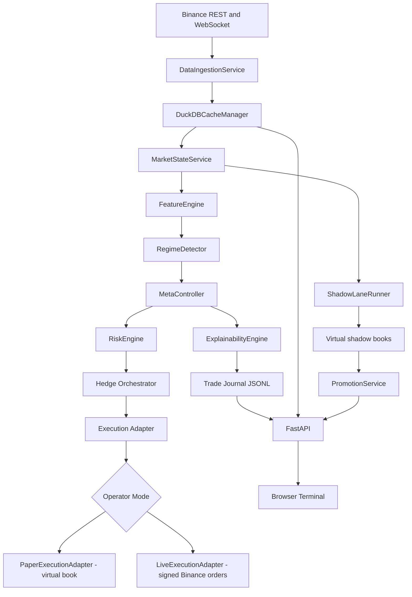
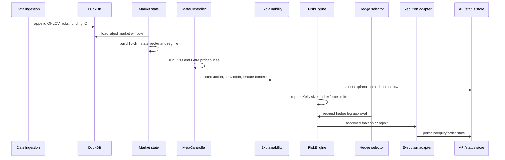
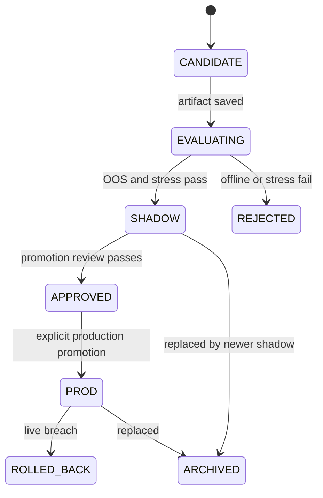

# APEX User Manual

This manual explains how to start, operate, train, monitor, and reason about the
APEX trading system. It is written for an operator who wants to run the backend,
use the browser terminal, train models safely, understand the code architecture,
and know what the model is actually capable of today.

APEX is a production-oriented autonomous trading framework for Binance USD-M
ETHUSDC. It is not a plug-and-play profit machine. Treat it as an engineered
trading system with strict data, model, risk, execution, and governance layers.
Paper mode should be your normal working mode until the model registry, paper
gate, shadow evidence, and live safety checks all agree.

## Operating Principles

- Default to paper mode.
- Never run live without a registered `PROD` model, valid paper evidence, and
  exchange credentials that you intentionally exported for this session.
- Shadow is not a third operator mode. Shadow is a virtual MLOps lane used to
  compare candidate models against the primary model.
- The model proposes. Risk decides. Execution adapts. The operator can pause,
  flatten, or kill-switch from the terminal.
- Data quality matters as much as model quality. Stale DuckDB rows, missing
  features, or broken journals make the model evidence unreliable.

## Quick Start

Use this sequence for a fresh local run.

```bash
cd /Users/piyush/Documents/Codebase/apex_trading_engine
bash scripts/setup_dev.sh
source venv/bin/activate
pre-commit install
```

Run the validation suite before operating:

```bash
PATH="$PWD/venv/bin:$PATH" make ci-local
```

Start the cockpit, API, frontend, and paper loop with one command:

```bash
source venv/bin/activate
python -m src.ops.cockpit --paper
```

Open the terminal:

```text
http://127.0.0.1:5173/?api=http://127.0.0.1:8080
```

If you want only the API and frontend first, omit `--paper` and use the
frontend `Runbook` tab to start paper trading or training later:

```bash
python -m src.ops.cockpit
```

Manual three-terminal mode is still supported:

```bash
python -m src.api.server
python -m http.server 5173 --directory frontend
APEX_EXECUTION_MODE=paper python -m src.pipelines.paper_trade
```

Check the API:

```bash
curl -s http://127.0.0.1:8080/health
curl -s http://127.0.0.1:8080/status
curl -s http://127.0.0.1:8080/portfolio
curl -s http://127.0.0.1:8080/explain/latest
```

Run the most useful operator reports:

```bash
python -m src.reports.paper_health_watchdog --config configs/base.yaml --format markdown
python -m src.reports.shadow_sanity_monitor --config configs/base.yaml --format markdown
python -m src.reports.model_governance_report --config configs/base.yaml --format markdown
python -m src.reports.experiment_ledger_auditor --config configs/base.yaml --format markdown
python -m src.reports.data_freshness_check --config configs/base.yaml --format markdown
python -m src.reports.frontend_api_contract_smoke --api-base-url http://127.0.0.1:8080 --live-api --format markdown
```

## Repository Map

```text
apex_trading_engine/
├── configs/
│   ├── base.yaml                 # Main runtime configuration
│   └── risk_profiles.yaml        # Conservative/balanced/aggressive overlays
├── frontend/
│   ├── index.html                # Static browser terminal shell
│   ├── app.js                    # React cockpit and API client
│   └── styles.css                # Terminal styling
├── src/
│   ├── api/                      # FastAPI status, history, controls, models
│   ├── core/                     # Config loading, logging, secrets
│   ├── data/                     # Binance clients, DuckDB, features, market state
│   ├── execution/                # Paper/live adapters, risk, portfolio, live gate
│   ├── mlops/                    # Training, registry, shadow lane, promotion
│   ├── models/                   # PPO, GBM, meta-controller, regime detector
│   ├── observability/            # Prometheus-compatible metrics
│   ├── pipelines/                # Shared trading loop, paper/live entrypoints
│   ├── reports/                  # Health, governance, data, paper, hedge reports
│   └── strategies/hedge/         # Hedge plugins and selector
├── tests/                        # Unit, integration, risk, API, MLOps coverage
├── data_lake/                    # Local runtime data, git-ignored
└── docs/                         # Roadmaps, testing, governance, manuals
```

## Architecture

### System View



The system has two runtime paths:

- Primary path: the actual operator path, either paper or live.
- Shadow path: virtual candidate model evaluation. It never places real orders.

### Trading Tick Flow



### Model Lifecycle



## Main Runtime Components

### Data Layer

The data layer lives mostly in `src/data/`.

- `BinanceRESTClient` fetches historical klines, premium/index data, account
  data, signed order endpoints, leverage, and live-order helpers.
- `BinanceWebSocketClient` subscribes to live streams.
- `DataIngestionService` bootstraps historical data, starts live streams,
  buffers ticks, polls funding/open interest, and writes to DuckDB.
- `DuckDBCacheManager` stores:
  - `ohlcv`
  - `ticks`
  - `features`
  - `paper_equity_snapshots`
  - `market_snapshots`
- `MarketStateService` loads the latest data window, computes features, detects
  the regime, persists the latest feature vector, and returns a model-ready
  snapshot.

### Feature And State Logic

`FeatureEngine` creates:

- orderflow approximations and cumulative volume delta
- buy/sell liquidity sweep flags
- ETH/BTC beta and relative strength z-score
- ATR and volatility z-score

`state_vector.py` converts the latest feature row into this 10-dimensional
model input:

```text
0 price_momentum
1 volume_accumulation
2 cvd_signal
3 buy_liquidity_sweep
4 sell_liquidity_sweep
5 eth_btc_beta
6 eth_btc_zscore
7 atr_norm
8 volatility_zscore
9 trend_slope
```

### Model Layer

`MetaController` runs both model families and chooses the active decision by
regime:

- trend and volatility expansion regimes prefer PPO
- chop and mean-reversion regimes prefer GBM

Actions are encoded as:

```text
0 SHORT
1 FLAT
2 LONG
```

The model output is not used directly as an order. It becomes a proposal with a
conviction score. Risk then decides whether any size is allowed.

### Risk Layer

`RiskEngine` is independent of the model. It enforces:

- max leverage
- Kelly cap
- daily drawdown kill switch
- gross leverage in hedge mode
- net leverage in hedge mode
- max hedge ratio

The simplified sizing flow is:

```text
model conviction -> journal calibration -> Kelly fraction -> exposure cap -> hedge limits -> approved fraction
```

The trading loop calibrates Kelly inputs from the trade journal when enough
paper/live evidence exists for the current mode, book, and regime. If the regime
sample is sparse, it can fall back to all-regime journal evidence. If the journal
does not yet have enough directional outcomes, it uses the configured defaults
(`0.55`, `1.2`) and records that fallback in status and journal payloads.

### Execution Layer

Execution adapters live under `src/execution/adapters/`.

- `PaperExecutionAdapter` simulates maker-style orders and virtual fills.
- `LiveExecutionAdapter` sends signed REST orders to Binance.
- `create_execution_adapter()` selects paper or live for the primary book.
- Shadow lanes always use virtual execution even when the primary operator mode
  is live.

### Hedge Layer

Hedge strategies live under `src/strategies/hedge/`.

Implemented plugins include:

- signal disagreement
- regime straddle
- protective hedge
- ETH/BTC relative strength hedge
- sweep dual leg
- maker grid hedge
- funding bias hedge

The orchestrator scores candidate hedges and returns a proposal. Risk still
approves or rejects hedge legs before execution.

### API And Frontend

The backend is `src/api/server.py`. It exposes runtime status, history, model
registry state, paper metrics, hedge reports, audit logs, and operator controls.

Important endpoints:

```text
GET  /health
GET  /status
GET  /portfolio
GET  /metrics/paper
GET  /explain/latest
GET  /history/decisions
GET  /history/equity
GET  /history/market
GET  /models
GET  /models/lifecycle
GET  /models/promotion/status
GET  /live/gate
GET  /ops/readiness
GET  /ops/workflow
GET  /ops/processes
GET  /audit
GET  /control/state
POST /control/{command}
POST /ops/processes/{process_name}
WS   /ws/status
WS   /ws/market
```

The browser terminal in `frontend/` is a static React app. It polls the API and
subscribes to `/ws/status` for runtime state and `/ws/market` for the live price
tape. Its operator controls record auditable intent in
`data_lake/operator_controls.json`. The trading pipeline consumes that state.
The `Runbook` tab reads `/ops/workflow` and `/ops/processes` so paper trading
and retraining can be started or stopped from the browser after the API runtime
is up.

Control commands:

- pause
- resume
- kill-switch
- clear-kill-switch
- flatten
- set-mode
- set-risk-profile

`set-mode` records intent, but an actual paper/live mode change requires a
controlled process restart.

### Low-Latency And HFT Boundary

APEX now has a lower-latency local operating path:

- `python -m src.ops.cockpit --paper` starts the supervised local stack.
- `/ws/market` streams Binance mark, aggregate trade, and depth events directly
  to the browser live chart.
- `api.status_ws_interval_sec` controls runtime websocket cadence.
- `data.loop_interval_sec` controls the trading decision loop cadence.
- `data.ingestion.tick_flush_size` controls how quickly buffered ticks are
  flushed into DuckDB.

This is useful for fast retail/exchange automation and for measuring latency in
the cockpit. It is not true institutional HFT. Real HFT would require exchange
co-location or proximity hosting, deterministic networking, kernel bypass or
specialized market-data handlers, a much thinner order gateway, strict clock
sync, and exchange-native queue-position analytics. Treat this codebase as a
latency-aware autonomous trading engine, not a co-located microsecond platform.

## Setup And First Run

### Environment

```bash
cd /Users/piyush/Documents/Codebase/apex_trading_engine
python3 -m venv venv
source venv/bin/activate
python -m pip install --upgrade pip
pip install -r requirements.txt
pip install -r requirements-dev.txt
pre-commit install
```

For real LightGBM training on macOS, install the OpenMP runtime once:

```bash
brew install libomp
```

### Optional Secret Setup

Generate a Fernet master key:

```bash
python - <<'PY'
from cryptography.fernet import Fernet
print(Fernet.generate_key().decode())
PY
```

Export it:

```bash
export APEX_MASTER_KEY="<generated_fernet_key>"
```

For live mode only:

```bash
export BINANCE_API_KEY="<your_key>"
export BINANCE_API_SECRET="<your_secret>"
```

Do not put real API keys in git-tracked files.

### Validation

Preferred local gate:

```bash
PATH="$PWD/venv/bin:$PATH" make ci-local
```

Focused checks:

```bash
venv/bin/pre-commit run --all-files
make test-risk
make frontend-test
venv/bin/pytest tests/ -q --cov=src --cov-fail-under=95 --cov-report=term-missing:skip-covered
```

## Operating The Backend And Frontend

### Terminal 1: API

```bash
source venv/bin/activate
python -m src.api.server
```

The API defaults to `127.0.0.1:8080`.

### Terminal 2: Frontend

```bash
source venv/bin/activate
python -m http.server 5173 --directory frontend
```

Open:

```text
http://127.0.0.1:5173/?api=http://127.0.0.1:8080
```

Use the browser terminal to watch:

- websocket health
- stale runtime status
- current regime
- model id
- portfolio
- latest explanation
- hedge and risk state
- model registry
- promotion status
- audit commands

### Terminal 3: Paper Pipeline

```bash
source venv/bin/activate
export APEX_EXECUTION_MODE=paper
python -m src.pipelines.paper_trade
```

Paper mode:

- uses real market data
- keeps the primary book virtual
- writes equity snapshots to DuckDB
- writes explanations to the trade journal
- can run shadow virtual lanes
- is the required proving ground before live

### Terminal 4: Reports

```bash
python -m src.reports.paper_report --config configs/base.yaml
python -m src.reports.hedge_report --days 7 --config configs/base.yaml
python -m src.reports.paper_health_watchdog --config configs/base.yaml --strict --format markdown
python -m src.reports.shadow_sanity_monitor --config configs/base.yaml --strict --format markdown
python -m src.reports.data_freshness_check --config configs/base.yaml --strict --format markdown
```

Use non-strict mode when running in a clean CI workspace that has no local data
lake yet. Use strict mode when you expect an active local session to be
producing fresh telemetry.

## Training And Model Governance

### What Training Does

Training is batch retraining from DuckDB OHLCV. It is not currently live online
reinforcement learning.

`AutoRetrainPipeline` performs:

1. Load cached OHLCV for `data.target_symbol` and `data.target_interval`.
2. Refuse to train if rows are below `mlops.min_training_rows`.
3. Build a supervised dataset from returns, volume z-score, trend, volatility,
   and price-derived features.
4. Split train/out-of-sample.
5. Train a candidate model (`GBM` by default, `PPO` if configured).
6. Save the artifact under `data_lake/models/<model_id>/`.
7. Register the model and write an immutable manifest.
8. Run out-of-sample backtest metrics.
9. Run stress metrics.
10. Promote only safe candidates to `SHADOW`.
11. Append all events to `data_lake/mlops/experiments.jsonl`.

Run it:

```bash
source venv/bin/activate
python -m src.mlops.auto_retrain
```

Inspect evidence:

```bash
cat data_lake/models/registry.json
tail -n 50 data_lake/mlops/experiments.jsonl
python -m src.reports.experiment_ledger_auditor --config configs/base.yaml --strict --format markdown
python -m src.reports.model_governance_report --config configs/base.yaml --format markdown
```

### Model States

```text
CANDIDATE -> EVALUATING -> SHADOW -> APPROVED -> PROD
                         -> REJECTED
PROD -> ROLLED_BACK / ARCHIVED
```

Meaning:

- `CANDIDATE`: registered but not evaluated.
- `EVALUATING`: artifact exists and offline evaluation is underway.
- `SHADOW`: offline and stress gates passed; can run in virtual shadow books.
- `APPROVED`: cleared for production promotion.
- `PROD`: only state allowed for live inference.
- `REJECTED`: failed gates.
- `ROLLED_BACK`: removed from production after a live breach.
- `ARCHIVED`: superseded by another model.

### Promotion Discipline

Auto-retrain can promote to `SHADOW`, not directly to live production.

Promotion from shadow to prod requires:

- enough shadow decisions
- shadow drawdown below threshold
- material Sharpe improvement over primary
- registry approval
- saved artifact
- manifest
- data snapshot id
- git hash

Check promotion posture:

```bash
curl -s http://127.0.0.1:8080/models/promotion/status
```

### Is There A Live AI Model Yet?

The project supports live model loading through `ModelRegistry`, but a live-ready
model is not guaranteed by the repository itself. Live mode is deliberately
blocked unless `active_prod` points to a registry entry with:

- status `PROD`
- saved model artifact
- manifest
- data snapshot id
- git hash

If no production artifact is loaded, the controller can still run defaults in
paper mode, but you should treat those as development behavior, not tradable
intelligence.

## How The Model Thinks And Learns

### Inference

Each tick becomes a normalized 10-value state vector. PPO and GBM both produce
probabilities over:

```text
SHORT, FLAT, LONG
```

`MetaController` chooses which model family to trust based on regime. The chosen
action and conviction become an intent:

```text
state vector + regime -> PPO/GBM probabilities -> selected action -> conviction
```

The explainability layer then translates that into:

- primary reasons
- risk factors
- confidence buckets
- feature contributions
- market narrative
- position context

### Learning

Current learning is governed batch retraining:

- GBM uses LightGBM when available, otherwise a deterministic centroid fallback.
- PPO currently has a supervised warm-start training path, not full rollout PPO.
- Labels come from next-bar future returns with `mlops.label_return_threshold`.
- Training features are causal/current-bar features only; future returns are not
  allowed as model inputs.
- Candidate quality is judged through out-of-sample and stress gates.
- Shadow lanes collect virtual evidence before production promotion.

### Is This Up To Expectations?

For a production framework: yes, the architecture is pointed in the right
direction. It separates data, inference, risk, execution, shadow evaluation,
promotion, and operator controls. That is exactly the discipline a serious
trading system needs.

For an autonomous alpha model: improving, but not finished. The current model
logic is still scaffold-to-intermediate:

- PPO is not yet a full online reinforcement learning loop.
- GBM can be real LightGBM, but the quality depends entirely on your cached data
  and labels.
- Kelly sizing now uses journal-calibrated paper/live evidence when available,
  with conservative defaults until enough outcomes exist.
- Production confidence must come from paper and shadow evidence, not from code
  structure alone.
- Auto-retrain now records walk-forward evidence across expanding time slices.
  It is configurable as a non-blocking evidence report or a hard promotion gate.
- Feature engineering is useful but still compact. More robust microstructure
  features, label research, and deeper regime-specific model calibration would
  further improve decision quality.

The correct expectation is:

```text
Use APEX to collect data, train candidates, reject weak models, shadow-test
promising models, and only then consider production promotion.
```

## Configuration Manual

Main config: `configs/base.yaml`  
Risk overlays: `configs/risk_profiles.yaml`

`load_config()` also reads:

```bash
export APEX_EXECUTION_MODE=paper
export APEX_EXECUTION_MODE=live
```

That environment variable overrides `execution.operator_mode`.

### data

```yaml
data:
  target_symbol: ETHUSDC
  macro_symbol: BTCUSDC
  target_interval: 3m
  macro_intervals: ["5m", "15m", "30m"]
  stream_safety_delay_sec: 1.2
  loop_interval_sec: 3.0
```

Effects:

- `target_symbol` is the traded symbol. The system is built around ETHUSDC.
- `macro_symbol` is used for relative strength features.
- `target_interval` controls candle resolution, state vectors, training labels,
  and annualization assumptions.
- `loop_interval_sec` controls how often the trading loop evaluates. Lower is
  more responsive but increases API/cache load.
- `stream_safety_delay_sec` gives live streams a small timing buffer.

### data.ingestion

```yaml
ingestion:
  enabled: true
  initial_backfill_days: 7
  tick_flush_size: 100
  funding_poll_sec: 300
  repair_gaps: true
```

Effects:

- `enabled=false` disables live ingestion and expects existing DuckDB data.
- `initial_backfill_days` controls REST bootstrap depth.
- `tick_flush_size` controls how often buffered ticks are persisted.
- `funding_poll_sec` controls funding/open-interest polling cadence.
- `repair_gaps=true` attempts to fix missing OHLCV windows.

### data.storage

```yaml
storage:
  type: duckdb
  db_path: data_lake/apex_market_data.duckdb
  cache_dir: data_lake/
```

Effects:

- `db_path` is the canonical local market and paper-equity store.
- Reports, API history, paper gate, training, and data freshness checks depend
  on this file.

### environment

```yaml
environment:
  initial_capital: 1000
  transaction_cost_pct: 0.0
  slippage_k: 0.0
  slippage_floor: 0.0
  warmup_steps: 80
  flat_threshold: 0.40
```

Effects:

- `initial_capital` seeds paper/shadow books and risk equity.
- transaction/slippage values affect simulation and reward assumptions.
- reward penalty fields are used by training/backtest style logic.
- `flat_threshold` affects how conservative flat behavior should be in reward
  design.

### funding

```yaml
funding:
  enabled: true
  source: binance
  default_rate: 0.0001
  interval_hours: 8
  continuous_approx: true
```

Effects:

- Funding is included in market snapshots and hedge context.
- `funding_bias_hedge` uses funding extremes as a possible hedge signal.

### technicals

```yaml
technicals:
  rolling_window: 120
  atr_period: 10
  ema_fast: 20
  ema_trend_short: 10
  ema_trend_long: 50
  alpha_rsv_period: 6
  alpha_causality_period: 6
  macro_vol_z_period: 144
```

Effects:

- Larger windows reduce noise but react slower.
- Smaller windows react faster but overfit short-term moves.
- ATR and volatility settings affect regime detection, state vectors, and hedge
  logic.
- Relative strength windows affect ETH/BTC z-score stability.

### risk and risk_profiles

`configs/base.yaml` selects:

```yaml
risk:
  profile: balanced
```

`configs/risk_profiles.yaml` defines:

- `conservative`
- `balanced`
- `aggressive`

The selected profile is merged into both `risk` and `execution` config. This
means changing `risk.profile` affects actual order approval limits.

Conservative:

- lower leverage
- lower daily drawdown
- lower Kelly cap
- lower hedge ratio

Aggressive:

- higher leverage
- higher daily drawdown
- higher Kelly cap
- higher hedge allowance

Use from frontend:

```text
Controls -> risk profile -> confirm
```

Or edit config and restart the pipeline.

### execution

```yaml
execution:
  operator_mode: paper
  position_mode: hedge
  post_only: true
  chase_tolerance: 3
  max_leverage: 3
  kelly_fraction_cap: 0.3
  max_daily_drawdown: 0.05
  max_gross_leverage: 2.0
  max_net_leverage: 1.0
  max_hedge_ratio: 0.35
```

Effects:

- `operator_mode` selects paper or live.
- `position_mode=hedge` allows separate long and short legs.
- `post_only=true` expresses maker-first behavior.
- `chase_tolerance` controls how much order replacement/chasing is allowed by
  execution logic.
- leverage/drawdown/Kelly fields are hard risk caps.
- gross/net/hedge ratio fields are especially important in hedge mode.

### paper

```yaml
paper:
  enabled: true
  min_days: 7
  min_trades: 100
  min_sharpe: 1.0
  max_drawdown: 0.08
```

Effects:

- These are the paper-to-live gate thresholds.
- Live startup refuses to proceed unless paper history passes, unless
  `live.skip_paper_gate=true`.

Check it:

```bash
curl -s http://127.0.0.1:8080/live/gate
```

### explainability

```yaml
explainability:
  journal_path: data_lake/trade_journal.jsonl
  min_conviction_flat: 0.35
  max_risk_factors_open: 3
```

Effects:

- `journal_path` is the main decision evidence file.
- conviction/risk settings influence explanation and risk narrative behavior.

### live

```yaml
live:
  enabled: false
  skip_paper_gate: false
  testnet: false
  leverage: 3
  margin_type: CROSS
```

Effects:

- `enabled=false` blocks live startup.
- `skip_paper_gate=true` bypasses paper evidence. Do not use with real capital
  unless you are deliberately doing controlled emergency testing.
- `leverage` is applied during live startup.
- `margin_type` documents desired margin posture.

Live mode also requires:

```bash
export BINANCE_API_KEY=...
export BINANCE_API_SECRET=...
```

### mlops

```yaml
mlops:
  registry_dir: data_lake/models
  experiment_log_path: data_lake/mlops/experiments.jsonl
  min_training_rows: 120
  min_supervised_rows: 120
  candidate_model_type: GBM
  label_return_threshold: 0.0005
  label_horizon_bars: 3
  label_cost_buffer_bps: 4.0
  feature_version: v1
  quality:
    min_history_days: 90
    min_directional_ratio: 0.12
    max_dominant_label_ratio: 0.80
    max_near_threshold_ratio: 0.45
    trade_probability_threshold: 0.55
    min_trade_signal_coverage: 0.05
    max_expected_calibration_error: 0.35
    max_brier_score: 0.80
  walk_forward:
    enabled: true
    required: false
    folds: 3
    min_train_fraction: 0.45
    min_test_rows: 10
    min_pass_rate: 0.66
  calibration:
    min_samples: 20
    default_win_rate: 0.55
    default_win_loss_ratio: 1.2
```

Effects:

- `registry_dir` stores artifacts, manifests, registry state, and lifecycle
  events.
- `experiment_log_path` stores the append-only training ledger.
- `min_training_rows` prevents under-sampled retraining.
- `min_supervised_rows` prevents training after horizon labels drop too many
  rows from the raw candle dataset.
- `candidate_model_type` selects `GBM` or `PPO`.
- `label_return_threshold` controls how future returns become SHORT/FLAT/LONG
  labels. Higher thresholds produce fewer directional labels.
- `label_horizon_bars` controls how far forward the training label looks. Longer
  horizons reduce one-bar noise but make labels slower.
- `label_cost_buffer_bps` forces labels to clear estimated cost before becoming
  LONG or SHORT. If the threshold is smaller than the cost buffer, the cost
  buffer wins.
- `feature_version` is written into model evidence.
- `quality.min_history_days` blocks shadow promotion when the local training
  window is too short for robust crypto regime evidence.
- `quality.min_directional_ratio` and `quality.max_dominant_label_ratio` protect
  against training on mostly FLAT or single-class targets.
- `quality.max_near_threshold_ratio` flags labels that sit too close to the
  decision threshold and could flip after noise, fees, or slippage.
- `quality.trade_probability_threshold` and
  `quality.min_trade_signal_coverage` make sure the candidate produces enough
  confident directional signals to be useful.
- `quality.max_expected_calibration_error` and `quality.max_brier_score` gate
  models whose probabilities are too poorly calibrated on OOS labels.
- `walk_forward.enabled=true` runs expanding-window validation after the normal
  OOS backtest.
- `walk_forward.required=false` means weak walk-forward evidence is recorded but
  does not block shadow promotion. Set it to `true` when the dataset is large
  enough and you want temporal stability to be a hard gate.
- `walk_forward.folds` controls how many expanding windows are tested.
- `walk_forward.min_pass_rate` is the fraction of folds that must pass when the
  gate is required.
- `calibration.min_samples` controls how many directional journal outcomes are
  required before Kelly sizing trusts observed paper/live performance.
- `calibration.default_win_rate` and `calibration.default_win_loss_ratio` are the
  conservative fallback Kelly assumptions used while evidence is sparse.

### mlops.evaluation

```yaml
evaluation:
  min_trades: 50
  min_sharpe: 1.5
  max_drawdown: 0.10
  min_profit_factor: 1.0
  min_win_rate: 0.0
```

Effects:

- These gates decide whether a candidate passes out-of-sample evaluation.
- Raising them makes promotion harder but safer.
- Lowering them increases model churn and risk of promoting noise.

### mlops.stress

```yaml
stress:
  cost_bps: 4.0
  max_drawdown: 0.10
  min_return: 0.0
```

Effects:

- Adds transaction-cost stress to the candidate equity curve.
- Protects against models that only work before realistic frictions.

### promotion

```yaml
promotion:
  min_shadow_trades: 50
  min_sharpe_delta: 0.15
  max_shadow_drawdown: 0.10
  max_live_drawdown: 0.10
  min_live_sharpe: -0.25
```

Effects:

- Controls shadow-to-prod promotion and rollback posture.
- `min_shadow_trades` prevents small-sample promotion.
- `min_sharpe_delta` demands material improvement over primary.
- live thresholds protect the production model after deployment.

### observability

```yaml
observability:
  metrics:
    enabled: true
    port: 9108
```

Effects:

- Starts Prometheus-compatible metrics if enabled.
- Disable only if the port conflicts or you are running minimal local tests.

### shadow

```yaml
shadow:
  enabled: true
  auto_register: true
  max_parallel_candidates: 2
  shared_features: true
```

Effects:

- Shadow lanes run candidate models virtually.
- `shared_features=true` keeps shadow and primary comparisons fair because they
  see the same market state.
- `max_parallel_candidates` limits compute and journal noise.

### hedge

```yaml
hedge:
  enabled: true
  selection: rule_based
  min_score: 0.5
  max_hedge_ratio: 0.35
```

Effects:

- `enabled=false` disables hedge proposals.
- `selection=rule_based` uses deterministic scoring.
- Bandit settings control when contextual selection can take over.
- Strategy sub-configs tune the individual hedge plugins.

## Live Mode Runbook

Use live only after paper and model governance pass.

1. Confirm data is fresh.

```bash
python -m src.reports.data_freshness_check --config configs/base.yaml --strict --format markdown
```

2. Confirm paper gate.

```bash
curl -s http://127.0.0.1:8080/live/gate
python -m src.reports.paper_health_watchdog --config configs/base.yaml --strict --format markdown
```

3. Confirm model readiness.

```bash
python -m src.reports.model_governance_report --config configs/base.yaml --format markdown
cat data_lake/models/registry.json
```

4. Export live credentials for this shell only.

```bash
export BINANCE_API_KEY="<key>"
export BINANCE_API_SECRET="<secret>"
```

5. Set config deliberately.

```yaml
execution:
  operator_mode: live

live:
  enabled: true
  skip_paper_gate: false
```

6. Start live.

```bash
python -m src.pipelines.live_trade
```

7. Keep frontend open and watch:

- kill switch
- drawdown
- position legs
- active model id
- latest explanation
- audit log
- API websocket status
- live price websocket status and tick latency

## Common Operator Workflows

### Check If The System Is Healthy

```bash
curl -s http://127.0.0.1:8080/status
curl -s http://127.0.0.1:8080/portfolio
python -m src.reports.paper_health_watchdog --config configs/base.yaml --format markdown
python -m src.reports.data_freshness_check --config configs/base.yaml --format markdown
```

### See What The Model Is Thinking

```bash
curl -s http://127.0.0.1:8080/explain/latest
tail -n 5 data_lake/trade_journal.jsonl
```

In the frontend, inspect the explanation, model probabilities, primary reasons,
risk factors, and market narrative.

### Pause Or Kill From Frontend

Use the controls panel. Dangerous commands require confirmation.

Under the hood, the API writes an audit event and updates:

```text
data_lake/operator_controls.json
data_lake/audit_events.jsonl
```

### Train A Candidate

```bash
python -m src.mlops.auto_retrain
python -m src.reports.experiment_ledger_auditor --config configs/base.yaml --format markdown
python -m src.reports.model_governance_report --config configs/base.yaml --format markdown
```

### Review Shadow

```bash
python -m src.reports.shadow_sanity_monitor --config configs/base.yaml --format markdown
curl -s http://127.0.0.1:8080/models/promotion/status
```

### Run Frontend/API Contract Smoke

Static:

```bash
python -m src.reports.frontend_api_contract_smoke --format markdown
```

Against a running API:

```bash
python -m src.reports.frontend_api_contract_smoke \
  --api-base-url http://127.0.0.1:8080 \
  --live-api \
  --format markdown
```

## What Good Looks Like

Before live:

- full local tests pass
- data freshness report passes in strict mode
- paper health watchdog passes in strict mode
- paper gate passes
- model governance report shows a ready `active_prod`
- shadow sanity has recent candidate evidence
- experiment ledger has clean runs
- frontend/API smoke test passes
- operator terminal shows fresh websocket status

During live:

- no stale status
- no unexplained position changes
- risk profile is intentional
- kill switch is inactive but available
- model id matches expected `active_prod`
- hedge decisions are visible and bounded
- paper/shadow reports continue to produce evidence

## Troubleshooting

### `make ci-local` cannot find black

Use the venv on PATH:

```bash
PATH="$PWD/venv/bin:$PATH" make ci-local
```

### Frontend shows stale or empty data

Check the API:

```bash
curl -s http://127.0.0.1:8080/health
curl -s http://127.0.0.1:8080/status
```

Check you opened the frontend with the right API override:

```text
http://127.0.0.1:5173/?api=http://127.0.0.1:8080
```

### Training skips with insufficient data

Check DuckDB:

```bash
python -m src.reports.data_freshness_check --config configs/base.yaml --format markdown
```

Run paper/ingestion long enough to populate OHLCV, or lower
`mlops.min_training_rows` only for controlled local testing.

### Live startup is blocked

Read the exact blockers:

```bash
curl -s http://127.0.0.1:8080/live/gate
python -m src.reports.model_governance_report --config configs/base.yaml --format markdown
```

Common causes:

- `live.enabled` is false
- missing Binance credentials
- paper gate failed
- no `active_prod`
- model artifact missing
- manifest missing
- data snapshot id missing
- git hash missing

### Risk gate rejects orders

Likely causes:

- kill switch active
- max leverage reached
- gross/net leverage cap reached
- hedge ratio too high
- conviction led to zero Kelly size

Inspect:

```bash
curl -s http://127.0.0.1:8080/status
curl -s http://127.0.0.1:8080/control/state
```

## Operator Checklist

Daily paper workflow:

```text
1. Pull latest main.
2. Activate venv.
3. Run local validation or at least risk/frontend checks.
4. Start API.
5. Start frontend.
6. Start paper pipeline.
7. Watch status, portfolio, explanations, and audit log.
8. Run paper health and data freshness reports.
9. Train only after data freshness is acceptable.
10. Review model governance before any promotion decision.
```

Pre-live workflow:

```text
1. Confirm active_prod is ready.
2. Confirm paper gate passes.
3. Confirm model governance is clean.
4. Confirm data freshness is strict-pass.
5. Confirm frontend/API contract smoke passes.
6. Export live credentials only in the live terminal.
7. Start live with frontend open.
8. Be ready to pause, flatten, or kill-switch.
```

## Final Operator Guidance

APEX gives you the scaffolding of a serious quant trading system: controlled
data, reproducible training, explainable decisions, hard risk gates, paper/live
separation, shadow lanes, and operator controls. Its strongest current value is
discipline. It helps you avoid promoting weak models or running live without
evidence.

The model itself should earn trust through:

- fresh data
- enough paper decisions
- clean experiment ledgers
- out-of-sample performance
- stress survival
- shadow improvement over primary
- stable live-readiness reports

Until that evidence is strong, operate it as a research and paper-trading
platform. Once the evidence is strong, the architecture is already shaped to
move carefully into live operation.
